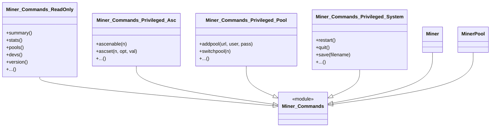
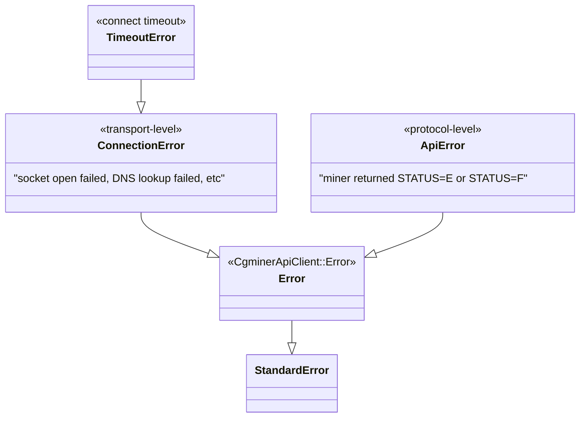

# Architecture

## Design goals

1. **One command surface, two execution shapes.** A single module (`Miner::Commands`) defines every cgminer command. `Miner` runs it against one host; `MinerPool` runs it against many in parallel. Consumers learn the command set once.
2. **Structural success/failure reporting.** Pool queries never silently drop failures or raise on the first one. Every miner gets a `MinerResult` and the caller decides what to do with failures.
3. **Zero runtime dependencies.** Only Ruby stdlib (`json`, `socket`, `yaml`).
4. **Transport-level vs protocol-level errors are distinct.** `ConnectionError` (couldn't reach the miner) is a different class from `ApiError` (miner answered and rejected). This matters operationally — a network blip shouldn't look like an auth denial.
5. **Library code never writes to stdout/stderr.** The CLI renders results; the library carries them.

## Design patterns

### Mixin-driven command surface

`Miner::Commands` is a module that includes two sub-modules: `ReadOnly` and `Privileged`. `Privileged` itself re-includes four namespaced sub-modules (`Asc`, `Pga`, `Pool`, `System`). Both `Miner` and `MinerPool` mix in `Miner::Commands`, so they share the exact same surface.



The Commands module calls `query(:foo)` on its including class. `Miner#query` hits the miner directly; `MinerPool#query` fans out across every miner in parallel and returns a `PoolResult`. So a single convenience method like `summary` works transparently in both contexts.

### `method_missing` fallback for uncommon cgminer commands

Both `Miner` and `MinerPool` define `method_missing(name, *) { query(name, *) }` so any cgminer API command not explicitly wrapped by `Miner::Commands` can still be called by name:

```ruby
pool.some_new_command('arg1', 'arg2')  # → pool.query(:some_new_command, 'arg1', 'arg2')
```

Both also implement `respond_to_missing?` so `respond_to?` and `Object#method` reflect this. The intentional carve-out: names starting with `to_` or `_` are rejected so implicit-conversion probes (`to_ary`, `to_str`, `to_hash`, `_dump`, etc.) and internal probes don't get forwarded to cgminer as real commands.

### Immutable value objects via `Data.define`

`MinerResult` uses Ruby 3.2+'s `Data.define` to get immutability, value-based equality, hashability, pattern-match support (`deconstruct_keys`), and a decent `inspect` for free. The class adds only domain helpers (`.success`, `.failure`, `#ok?`, `#failed?`, `#raise!`).

This is deliberately not a custom `Result`/`Either` hierarchy with success/failure subclasses — `Data.define` with two factories and an `ok?` predicate carries enough weight and costs nothing to define.

### Enumerable result collection

`PoolResult` wraps `Array<MinerResult>` and includes `Enumerable`. Callers iterate `MinerResult`s by default and reach for `.values` / `.errors` / predicate helpers for common projections. Lookup-by-key (`result[0]`, `result[miner]`, `result["host:port"]`) is provided via `#[]`.

`PoolResult` is frozen at construction (`@results.freeze`), and equality delegates to the underlying results array.

### Parallel fan-out with capture-everything semantics

`MinerPool#query` spawns one `Thread` per miner. Each thread runs `miner.query` inside a rescue that converts **any** `StandardError` into a `MinerResult.failure`. After `join`-ing all threads, the results are wrapped in a `PoolResult` in pool order (via `threads.map(&:value)`).

Consequences:

- A single hostile/hung miner can't take down a pool query — other miners run concurrently and their results arrive intact.
- Failures are captured structurally, not re-raised. The caller sees which miners succeeded and which failed, with specific exceptions attached.
- Thread ordering is deterministic w.r.t. pool order (because the threads were created in iteration order and joined in the same order).

### Dual error taxonomy



`TimeoutError < ConnectionError` means callers that only care about "the miner is unreachable for any reason" can `rescue ConnectionError`, while callers who want to react specifically to connect timeouts (maybe log them differently) can `rescue TimeoutError`. All gem errors descend from `CgminerApiClient::Error < StandardError`, so a blanket `rescue CgminerApiClient::Error` covers everything gem-specific without catching unrelated exceptions.

### Module-level config via singleton methods

`lib/cgminer_api_client.rb` exposes `default_host`, `default_port`, and `default_timeout` as module-level attrs with lazy-default getters (`defined?(@x) ? @x : default`). `CgminerApiClient.config { |c| c.default_port = 4028 }` is just `yield self` — no builder class, no DSL. This keeps configuration inert when not used.

## The cgminer wire protocol (what the gem actually speaks)

The gem implements a narrow subset of cgminer's API — specifically, the JSON variant (not the plain-text one).

**Request:**

```json
{"command":"summary","parameter":"0"}
```

Sent as a single `write` on a TCP socket. `parameter` is optional; when present it's a comma-separated string. Literal commas and backslashes inside parameter values are backslash-escaped by `Miner#query` (see `CHANGELOG.md` for the gory history of how the escape used to silently no-op).

**Response:**

cgminer writes a JSON object and closes the connection. Read-to-EOF is how the client knows the response is complete. Every response has a `STATUS` array whose first element carries a `STATUS` code letter:

| Code | Meaning | Gem behavior |
|------|---------|--------------|
| `S`  | Success | silent |
| `I`  | Info    | `puts` to stdout |
| `W`  | Warning | `puts` to stdout |
| `E`  | Error   | raises `ApiError` |
| `F`  | Fatal   | raises `ApiError` |

The gem also performs two small input-repair passes on the raw response bytes before `JSON.parse`:

1. Bytes below 0x20 (control characters) are re-escaped as `\uXXXX`. Cgminer can emit raw control bytes in user-supplied strings (pool names, worker IDs) that break standard JSON parsers.
2. `}{` → `}, {` and `[,{` → `[ {` substitutions are attempted on malformed multi-command responses. This is legacy defensive code; see `spec/support/cgminer_fixtures.rb` for notes on whether it still fires.

After parsing, `Miner#sanitized` normalizes keys recursively: `"MHS av"` → `:mhs_av`, `"Pool Rejected%"` → `:pool_rejected%`. Callers always see snake_case symbol keys.

For commands whose name contains `+` (cgminer multi-command syntax, e.g. `summary+pools`), `check_status` is called per sub-response and the full data shape is returned as-is (no single-element unwrap).

## Single-miner convenience unwrap

Read-only methods that cgminer returns inside a single-element array — `summary`, `coin`, `config`, `version`, `check` — unwrap that one element in `Miner::Commands::ReadOnly` via `query(:name)[0]`. On a single `Miner` this is correct. On a `MinerPool` the inherited behavior would silently drop every miner except the first, so `MinerPool` overrides these five methods to map the unwrap across every successful `MinerResult` in a `PoolResult` instead:

```ruby
# MinerPool#summary (simplified)
unwrap_first(query(:summary))
# where unwrap_first replaces each successful MinerResult.value
# with value.first, passing failures through unchanged.
```

This was a pre-existing bug before 0.3.0; see `CHANGELOG.md` under "Fixed".

## Config file contract

`MinerPool.new` reads `config/miners.yml` relative to the process CWD using `YAML.safe_load_file`. Each entry is a hash with `host` (required), `port` (optional; falls back to `CgminerApiClient.default_port`), and `timeout` (optional). If the file doesn't exist, `MinerPool.new` raises `"Please create config/miners.yml"`.

The file is resolved relative to the process's CWD, not the gem's install location — meaning CLI users run it from a directory that has `config/miners.yml`, and library consumers embedding `MinerPool` need to either keep CWD aligned or construct `Miner` instances directly.

## What the CLI adds on top

`bin/cgminer_api_client` is a thin driver:

1. Validate that `ARGV[0]` corresponds to a known command (`Miner::Commands.instance_methods`); exit 64 (`EX_USAGE`) if not.
2. Build a `MinerPool` and run `pool.query(command, *ARGV)`.
3. Iterate the returned `PoolResult`:
   - Successes: print `host:port:` header to stdout, then `pp value`.
   - Failures: print `host:port: ErrorClass: message` to stderr.
4. Exit 0 if any miner succeeded, 1 if all failed.
5. `DEBUG=1` prints full backtraces for any top-level exception via `Exception#full_message(highlight: false)`.

The CLI is the only place in the gem that writes to stderr.
