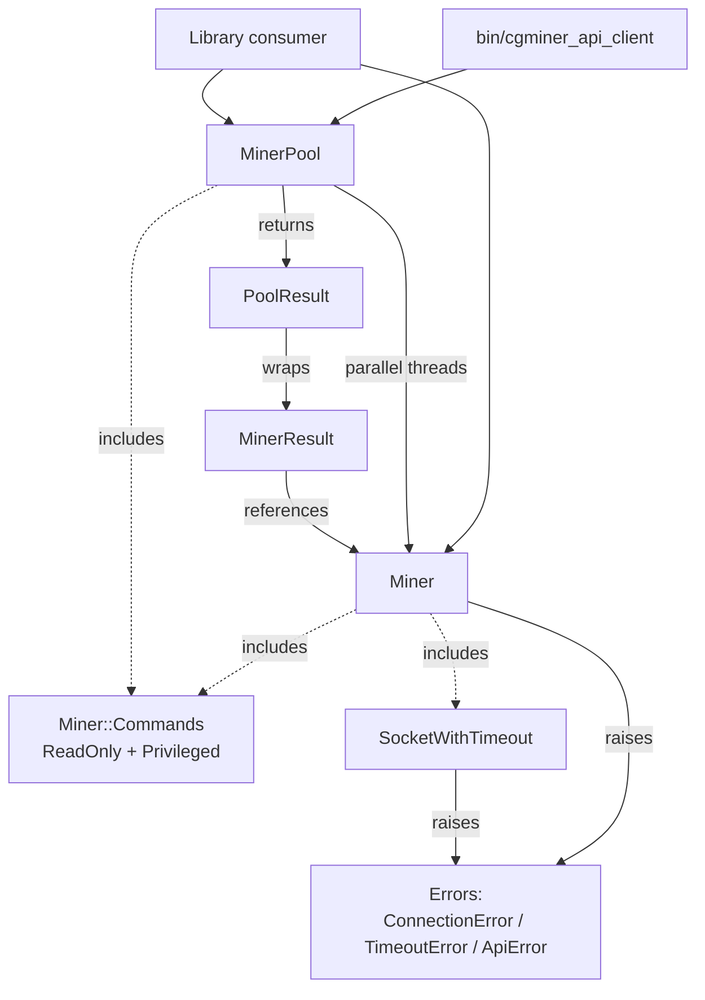

# Codebase Info

## What this is

`cgminer_api_client` is a pure-Ruby client for the [cgminer](https://github.com/ckolivas/cgminer) JSON-over-TCP API. It ships as both a library (for embedding into other Ruby applications) and a CLI (`bin/cgminer_api_client`) for operator use. Pool mode — fanning out a single command across many miners in parallel and aggregating per-miner results — is a first-class feature.

The gem is small (~650 SLOC in `lib/`) and single-purpose. It does not bundle a CLI framework, a logger, an HTTP library, or any other runtime dependency: everything is built on Ruby stdlib.

## Stack

- **Language:** Ruby 3.2+ (gemspec `required_ruby_version`). CI matrix tests 3.2, 3.3, 3.4, 4.0, and `head` (head allowed to fail). Local development is pinned to Ruby 4.0.2 via `.ruby-version`.
- **Runtime dependencies:** none beyond stdlib (`json`, `socket`, `yaml`).
- **Dev dependencies:** `rake`, `rspec`, `rubocop` (+ `rubocop-rspec`, `rubocop-rake`), `simplecov`.
- **Test framework:** RSpec 3.13. Unit specs at `spec/cgminer_api_client/**`, integration specs at `spec/integration/**`.
- **Lint:** RuboCop with `TargetRubyVersion: 3.2`. Default Rake task runs specs then rubocop.
- **CI:** GitHub Actions (`.github/workflows/ci.yml`). Runs `bundle exec rake` on every push/PR to `master` and `develop`.
- **Coverage:** SimpleCov; last reported at 99.66% on `lib/`.

## Directory layout

```
cgminer_api_client/
├── bin/
│   └── cgminer_api_client        # The CLI executable (packaged with gem)
├── lib/
│   ├── cgminer_api_client.rb     # Entry point: requires, default_host/port/timeout, .config
│   └── cgminer_api_client/
│       ├── errors.rb             # Error < StandardError, ConnectionError, TimeoutError, ApiError
│       ├── miner.rb              # Miner class: single-host client, query + perform_request
│       ├── miner/
│       │   └── commands.rb       # ReadOnly + Privileged (Asc, Pga, Pool, System) mixins
│       ├── miner_pool.rb         # MinerPool: parallel fan-out across a pool of Miners
│       ├── miner_result.rb       # Immutable MinerResult (Data.define) per-miner outcome
│       ├── pool_result.rb        # Enumerable PoolResult wrapper around Array<MinerResult>
│       ├── socket_with_timeout.rb# Non-blocking TCP connect with timeout
│       └── version.rb            # VERSION = "0.3.0"
├── spec/
│   ├── spec_helper.rb            # SimpleCov + loads support/**/*.rb
│   ├── cgminer_api_client_spec.rb
│   ├── cgminer_api_client/
│   │   ├── miner_spec.rb
│   │   ├── miner_pool_spec.rb
│   │   ├── miner_result_spec.rb
│   │   ├── pool_result_spec.rb
│   │   └── miner/commands_spec.rb
│   ├── integration/
│   │   ├── cli_spec.rb           # Spawns the real bin/ via Open3
│   │   └── miner_integration_spec.rb # Full request → socket → response path
│   └── support/
│       ├── cgminer_fixtures.rb   # Canned cgminer wire-format JSON responses
│       └── fake_cgminer.rb       # Tiny TCP server used by integration specs
├── script/
│   └── fake_cgminer              # Manual sandbox: starts FakeCgminer on a port
├── config/
│   └── miners.yml.example        # Ships in the gem; user copies to config/miners.yml
├── .github/workflows/ci.yml
├── .rubocop.yml                  # TargetRubyVersion 3.2; Metrics cops largely off
├── .rspec                        # --color --warnings --require spec_helper
├── .ruby-version                 # 4.0.2 (local dev only; gem supports 3.2+)
├── Rakefile                      # default: spec + rubocop
├── Gemfile / Gemfile.lock
├── cgminer_api_client.gemspec
├── CHANGELOG.md                  # Keep-a-Changelog format, 0.3.0 migration guide included
├── README.md
└── LICENSE.txt                   # MIT
```

Packaged-in-the-gem files are controlled by the `spec.files` glob in the gemspec: `lib/**/*.rb`, `bin/*`, `config/*.example`, README, LICENSE, CHANGELOG, and the gemspec itself. Notably, `spec/`, `script/`, and `.github/` are **not** packaged.

## Languages and tooling

| | |
|---|---|
| Primary language | Ruby |
| Other languages | None |
| Build tool | `bundler` (gem), `rake` (default task) |
| Package format | RubyGem (`.gem`) |
| Distribution | [RubyGems.org](https://rubygems.org/gems/cgminer_api_client) |

## High-level module map



## Key facts worth knowing up front

1. **`Miner` and `MinerPool` both `include Miner::Commands`.** The same read-only/privileged command surface works on both. On `Miner`, each command hits one miner. On `MinerPool`, each command fans out to every miner in parallel.
2. **`method_missing` on both classes** forwards unknown method names to `query(name, *args)`, so any cgminer API command not explicitly wrapped still works (`pool.some_new_command`).
3. **`query` returns parsed Ruby** (symbol-keyed snake_case hashes). Key normalization happens in `Miner#sanitized`.
4. **`MinerPool#query` returns a `PoolResult`** — an Enumerable of per-miner `MinerResult` instances. Failures are captured structurally (carried as `MinerResult.failure`), not thrown.
5. **The library never writes to stderr.** Error-to-stderr is the CLI's job.
6. **No runtime dependencies.** Stdlib only.

## Version and release posture

- Current release: **0.3.0** (2026-04-07). See `CHANGELOG.md` for the full release notes and 0.2.x → 0.3.0 migration guide.
- Semantic Versioning; the 0.x prefix means breaking changes are allowed between minor versions. 0.3.0 introduced several (see Migration Guide).
- `rubygems_mfa_required` is set in gemspec metadata.
