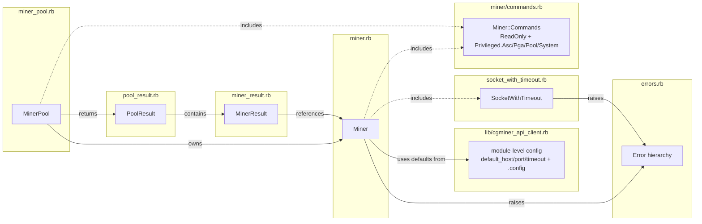

# Components

Every major component lives in a single file under `lib/cgminer_api_client/`. None of them exceed ~200 SLOC. The composition is flat; there is no ceremony layer (no service objects, no factories, no DI container).

## Component map



## Component list

### `CgminerApiClient` (module)
**File:** `lib/cgminer_api_client.rb`

Entry point and configuration holder. Loads all other files in dependency order and exposes module-level attrs:

- `default_host` (default `'127.0.0.1'`)
- `default_port` (default `4028`)
- `default_timeout` (default `5` seconds)
- `.config { |c| ... }` — yields `self` if a block is given; no-op otherwise

Used by `Miner#initialize` to fill in any constructor argument the caller left nil.

### `CgminerApiClient::Error` and siblings
**File:** `lib/cgminer_api_client/errors.rb`

Four exception classes:

- `Error < StandardError` — base class for everything gem-specific.
- `ConnectionError < Error` — transport-level failure (can't reach the miner).
- `TimeoutError < ConnectionError` — specifically a connect timeout.
- `ApiError < Error` — miner answered but returned STATUS=E or STATUS=F.

Raised from `Miner`, `MinerPool` (via rescue-and-capture), and `SocketWithTimeout`. See [architecture.md](architecture.md#dual-error-taxonomy).

### `CgminerApiClient::SocketWithTimeout` (module)
**File:** `lib/cgminer_api_client/socket_with_timeout.rb`

A one-method mixin: `open_socket(host, port, timeout)`. Builds a non-blocking TCP socket, attempts `connect_nonblock`, and uses `socket.wait_writable(timeout)` to wait for completion with a deadline. Raises `CgminerApiClient::TimeoutError` on expiry; returns the connected socket otherwise.

Handles the `Errno::EISCONN`-on-second-connect-nonblock quirk that Linux exhibits when connection completes during the wait. On macOS/BSD, the second call returns 0 cleanly and the `EISCONN` branch doesn't fire.

Mixed into `Miner`. The switch from `IO.select(nil, [socket], nil, timeout)` to `socket.wait_writable(timeout)` in 0.3.0 is what makes this Fiber-scheduler compatible.

### `CgminerApiClient::Miner`
**File:** `lib/cgminer_api_client/miner.rb`

Per-host client. Carries `host`, `port`, `timeout`. Constructor: `Miner.new(host = nil, port = nil, timeout = nil, on_wire: nil)` — positional args fall back to `CgminerApiClient.default_*`; `on_wire:` is an optional telemetry callback (see below).

Public surface:

- `query(method, *params)` — marshal request, send, parse, dispatch `check_status`, return sanitized data. Raises `ConnectionError` on transport failure, `ApiError` on cgminer-reported error.
- `available?` — true reachability probe. Opens a fresh socket every call (no cache). Returns `false` on `SocketError`/`SystemCallError`/`TimeoutError`; lets other exceptions propagate. Does **not** perform an API handshake.
- All methods from `Miner::Commands::ReadOnly` and `Miner::Commands::Privileged` via `include`.
- `method_missing` forwards unknown names to `query`.
- `respond_to_missing?` says yes for any name that isn't `to_*`/`_*`.

Private methods: `perform_request` (socket write/read/JSON parse, plus control-byte re-escape and `}{` repair), `check_status` (STATUS code dispatch), `sanitized` (recursive key normalization), `safe_on_wire` (invokes the `on_wire:` callback if present; swallows any exception the block raises so a buggy logger cannot break a query). `safe_on_wire` fires three directions: `:request` (outbound JSON), `:response` (raw inbound string, pre-parse), `:response_repaired` (only when the `}{` repair path actually runs — rare against modern cgminer).

### `CgminerApiClient::Miner::Commands` (module)
**File:** `lib/cgminer_api_client/miner/commands.rb`

Command surface. Four nested modules:

| Module | Scope | Notable members |
|---|---|---|
| `ReadOnly` | safe queries | `summary`, `stats`, `pools`, `devs`, `devdetails`, `coin`, `config`, `version`, `check(cmd)`, `notify`, `usbstats`, `privileged`, `asc(n)`, `asccount`, `pga(n)`, `pgacount` |
| `Privileged::Asc` | per-ASC ops | `ascenable`, `ascdisable`, `ascidentify`, `ascset` |
| `Privileged::Pga` | per-PGA ops | `pgaenable`, `pgadisable`, `pgaidentify`, `pgaset` |
| `Privileged::Pool` | pool config | `addpool`, `removepool`, `switchpool`, `enablepool`, `disablepool`, `poolpriority`, `poolquota` |
| `Privileged::System` | host-level | `restart`, `quit`, `save`, `setconfig`, `debug`, `failover_only`, `hotplug`, `zero` |

`Commands::ReadOnly#privileged` calls `query(:privileged)` and catches `ApiError` → `false` (miner refused). All other exceptions (including `ConnectionError`) propagate so a network blip doesn't read as "access denied." The `access_denied?` gate used by every `Privileged::*` method raises `CgminerApiClient::ApiError, 'access denied'` when `privileged` returns false, so a single rescue point in the caller picks up auth rejections.

Both `Miner` and `MinerPool` `include Miner::Commands`. The `Commands` methods only call `query(...)`; `Miner#query` and `MinerPool#query` provide the two execution shapes.

### `CgminerApiClient::MinerPool`
**File:** `lib/cgminer_api_client/miner_pool.rb`

Parallel fan-out wrapper. Constructor: `MinerPool.new(on_wire: nil)` — optional `on_wire:` callback is forwarded verbatim into every `Miner` the pool constructs, so one hook covers the whole fan-out. Loads `config/miners.yml` on construction (via `load_miners!`, using `YAML.safe_load_file`) and builds one `Miner` per entry.

Public surface:

- `query(method, *params)` — spawns one `Thread` per miner, runs `miner.query` inside each, and captures each result as a `MinerResult.success` or `.failure`. Returns a `PoolResult` of per-miner outcomes in pool order.
- `summary`, `coin`, `config`, `version`, `check(cmd)` — overridden to unwrap cgminer's single-element-array response on each `MinerResult.value` while preserving failures. Fixes the pre-0.3.0 bug where the inherited `ReadOnly` implementations silently dropped all but the first miner.
- `available_miners` — parallel `Miner#available?` across all miners; returns the reachable ones.
- `unavailable_miners` — `@miners - available_miners`.
- `miners` / `miners=` — direct access to the underlying array.
- `reload_miners!` — re-reads `config/miners.yml`.
- `method_missing` / `respond_to_missing?` — same forwarding shape as `Miner`.

All privileged/read-only commands from `Miner::Commands` are available here too and automatically execute in pool-parallel mode.

### `CgminerApiClient::MinerResult`
**File:** `lib/cgminer_api_client/miner_result.rb`

Immutable per-miner outcome. `Data.define(:miner, :value, :error)`. Always has `miner` set; exactly one of `value` or `error` is non-nil. Helpers: `.success(miner, value)`, `.failure(miner, error)`, `#ok?`, `#failed?`, `#raise!`.

`Data.define` gives `==`, `hash`, `eql?`, `inspect`, `to_h`, and `deconstruct_keys` for free, enabling pattern matching:

```ruby
case result
in { ok?: true,  value: }  then consume(value)
in { ok?: false, error: }  then log(error)
end
```

### `CgminerApiClient::PoolResult`
**File:** `lib/cgminer_api_client/pool_result.rb`

`Enumerable` wrapper around `Array<MinerResult>`. Preserves pool order. Frozen on construction.

| Method | Returns |
|---|---|
| `each(&)` | iterates `MinerResult` instances |
| `values` | `Array<value>` for successful results only |
| `errors` | `Array<exception>` for failed results only |
| `successful` | `Array<MinerResult>` where `ok?` |
| `failed` | `Array<MinerResult>` where `failed?` |
| `all_successful?`/`any_succeeded?`/`any_failed?` | `Boolean` |
| `size` / `empty?` / `to_a` | obvious |
| `[key]` | `MinerResult` by Integer index, `Miner` instance, or `"host:port"` string |

## CLI

### `bin/cgminer_api_client`
**File:** `bin/cgminer_api_client` (42 lines, shebang + executable)

Thin driver. Validates command name against `Miner::Commands.instance_methods`, builds a `MinerPool`, runs `pool.query`, prints per-miner output, exits. Accepts a `-v`/`--verbose` flag that installs a default `on_wire:` callback into the `MinerPool` it builds — the callback writes each direction (`>>>` request, `<<<` response, `<<< (repaired)` for the `}{` path) to stderr under a `Mutex` so interleaved per-miner lines don't tear, and rescues `Errno::EPIPE` / `IOError` so stderr closure mid-run doesn't break the query fan-out. See [architecture.md](architecture.md#what-the-cli-adds-on-top), [workflows.md](workflows.md#cli-request-flow), and [logging.md](logging.md) for details.

## Test-only components (not packaged in the gem)

### `FakeCgminer`
**File:** `spec/support/fake_cgminer.rb`

Tiny TCP server used by integration specs and the `script/fake_cgminer` manual sandbox. Accepts a connection, reads a JSON request, looks up the command name in a fixtures hash, writes the canned response, and closes the socket. Connection lifecycle deliberately mirrors real cgminer's write-then-EOF pattern so `Miner#perform_request`'s read-to-EOF call returns.

Resilient to per-connection errors: a malformed request won't take down the server. Closes the listening socket first on `#stop` because on macOS `Thread#kill` doesn't interrupt a thread blocked in C-level `accept`. Has a `.with(**)` class helper that brackets a block with start/stop, handy for specs.

### `CgminerFixtures`
**File:** `spec/support/cgminer_fixtures.rb`

Canned cgminer wire-format JSON responses for `summary`, `devs`, `pools`, multi-command `summary+pools`, control-byte `pools`, `addpool`, `privileged` OK, `privileged` denied, and a synthesizer for unknown-command replies. Fixtures are grounded in cgminer's actual `codes[]` table in `cgminer/api.c` (message codes, status letters, envelope shape).

### `script/fake_cgminer`
**File:** `script/fake_cgminer`

Standalone foreground wrapper around `FakeCgminer`. Starts a server on port 4028 (or a port argument), prints the commands it knows, and sleeps until `Ctrl-C`. Lives in `script/` rather than `bin/` so it isn't packaged with the gem.
