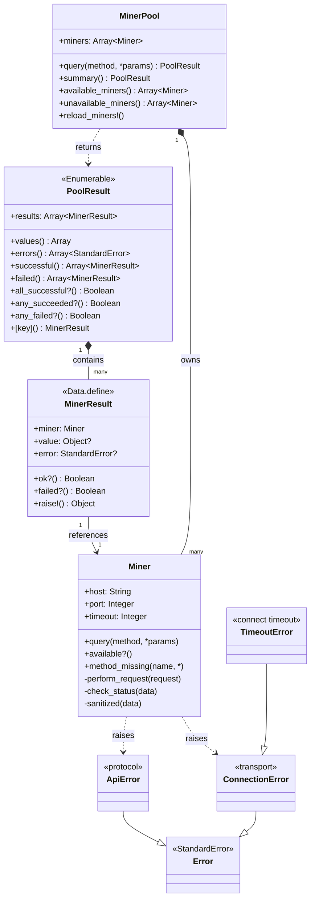
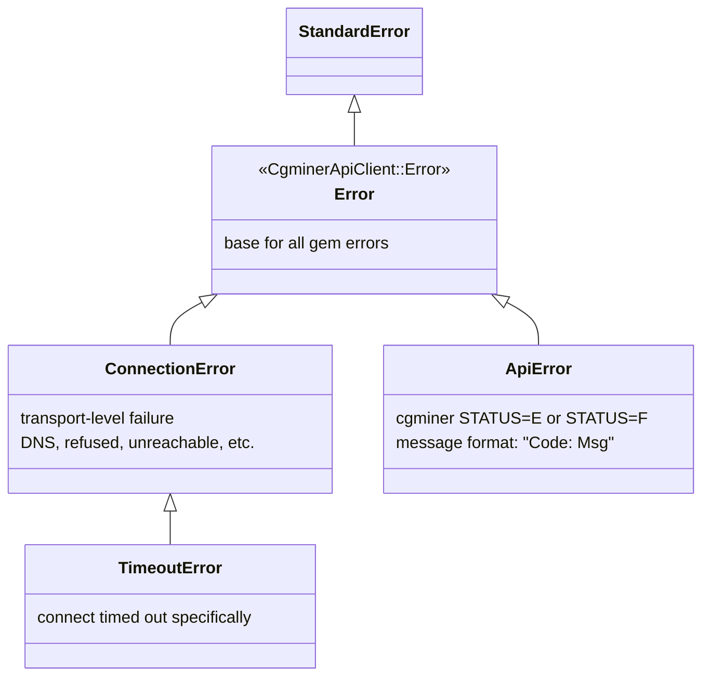

# Data Models

The gem has no database, no schema migrations, no ORM. "Data models" here means the runtime value objects that flow through the public API.

## Object graph



## `Miner`

Regular Ruby class with three mutable attrs (`host`, `port`, `timeout`) and methods mixed in from `Miner::Commands` and `SocketWithTimeout`. Not immutable — `attr_accessor` deliberately allows runtime reassignment, though that's rarely useful. Equality is object-identity (no `==` override).

## `MinerPool`

Regular Ruby class. Holds `@miners: Array<Miner>`. Built from `config/miners.yml`. Equality is object-identity. Not thread-safe to mutate (`reload_miners!`) concurrently with `query`.

## `MinerResult` (`Data.define`)

Immutable value object with three fields: `miner`, `value`, `error`. Always carries exactly one of `value` or `error` (never both, never neither).

### Invariants

```
MinerResult.success(miner, v)  ⇒  miner=m, value=v,   error=nil,  ok?=true,  failed?=false
MinerResult.failure(miner, e)  ⇒  miner=m, value=nil, error=e,    ok?=false, failed?=true
```

### Inherited from `Data.define`

- `#==`, `#eql?`, `#hash` — value equality based on all three fields.
- `#to_h` — `{miner: ..., value: ..., error: ...}`.
- `#inspect` — `#<data CgminerApiClient::MinerResult miner=..., value=..., error=...>`.
- `#deconstruct_keys(keys)` — enables pattern matching.
- Immutable; no setters.

### Defined methods

| Method | Purpose |
|---|---|
| `MinerResult.success(miner, value)` | Build a success. `error` defaults to nil. |
| `MinerResult.failure(miner, error)` | Build a failure. `value` defaults to nil. |
| `#ok?` | `error.nil?` |
| `#failed?` | `!ok?` |
| `#raise!` | re-raise `error` if failed; return `value` if successful |

### Pattern matching

```ruby
case result
in { ok?: true,  value: }  then consume(value)
in { ok?: false, error: }  then log(error)
end
```

## `PoolResult`

Enumerable wrapper around `Array<MinerResult>`. Frozen on construction (`@results.freeze`). Value equality (`#==` compares underlying arrays, `#eql?` is aliased to `#==`, `#hash` delegates to the underlying array).

### Invariants

- `results` is frozen and has one entry per miner in pool order.
- Order of `PoolResult#each` == pool order == order of `MinerPool#miners`.
- `successful ⊂ results`, `failed ⊂ results`, `successful ⊍ failed = results`, `successful ∩ failed = ∅`.
- `all_successful? = failed.empty?`, `any_failed? = !failed.empty?`.
- `values = successful.map(&:value)` (never contains nil unless a miner genuinely returned nil).
- `errors = failed.map(&:error)` (every entry is a StandardError subclass).

### Methods

| Method | Signature | Returns |
|---|---|---|
| `#each(&)` | yields `MinerResult` instances | self |
| `#size` | | `Integer` |
| `#empty?` | | `Boolean` |
| `#to_a` | | `Array<MinerResult>` (duped) |
| `#values` | | `Array<value>` — successes only |
| `#errors` | | `Array<StandardError>` — failures only |
| `#successful` | | `Array<MinerResult>` |
| `#failed` | | `Array<MinerResult>` |
| `#all_successful?` | | `Boolean` |
| `#any_succeeded?` | | `Boolean` |
| `#any_failed?` | | `Boolean` |
| `#[](key)` | `Integer`, `Miner`, or `String` | `MinerResult` or `nil` |
| `#==`, `#eql?`, `#hash` | | value-equality |
| `#results` | | the frozen array (read-only attr) |

`#[](key)` dispatch:
- `Integer` → `results[key]` (supports negative indexes).
- `String` → `find { |r| "#{r.miner.host}:#{r.miner.port}" == key }`.
- Anything else → `find { |r| r.miner == key }` (works for a `Miner` instance).

### What can be in `value`?

Whatever `Miner#query` returned for that command. For `MinerPool#summary`/`#coin`/`#config`/`#version`, the `unwrap_first` override replaces each value with `value.first` so consumers get a `Hash` instead of `[Hash]`. For everything else, value is the same shape the cgminer wire format produces, after key sanitization.

### What can be in `error`?

Any `StandardError` raised inside a worker thread during the pool query. In practice this is almost always `ConnectionError` (transport failure) or `ApiError` (cgminer rejected the command). Unexpected `StandardError`s (bugs) are *also* captured rather than re-raised, because the thread-local rescue in `MinerPool#query` is `rescue StandardError => e`.

## Error classes

All declared in `lib/cgminer_api_client/errors.rb`. Plain classes, no fields beyond what `StandardError` provides.



Where they're raised:

| Exception | Raised by | Trigger |
|---|---|---|
| `TimeoutError` | `SocketWithTimeout#open_socket` | `socket.wait_writable(timeout)` returned nil |
| `ConnectionError` | `Miner#perform_request` | any `StandardError` from `open_socket`, re-wrapped |
| `ApiError` | `Miner#check_status` | STATUS letter was E or F |

## Raw response shape (before the gem touches it)

Every response from cgminer has this skeleton:

```json
{
  "STATUS": [{ "STATUS": "S", "When": 1700000000, "Code": 11, "Msg": "Summary", "Description": "cgminer 4.11.1" }],
  "<COMMAND>": [ ... ],
  "id": 1
}
```

After `Miner#sanitized`, keys are lowercased + `_`-separated + symbolized:

```ruby
{
  status: [{status: "S", when: 1700000000, code: 11, msg: "Summary", description: "cgminer 4.11.1"}],
  summary: [{elapsed: 12345, mhs_av: 56789.12, ...}],
  id: 1
}
```

For most `ReadOnly` commands, the `Commands` module's `query(:name)[0]` unwrap extracts the inner array and the caller sees only the unwrapped hash (not the envelope). For `devs`/`stats`/`pools`/`notify`/`usbstats`/`asc(n)`/`pga(n)` the caller gets the array as-is. For multi-command (`summary+pools`), the full envelope is returned with every sub-key intact.
