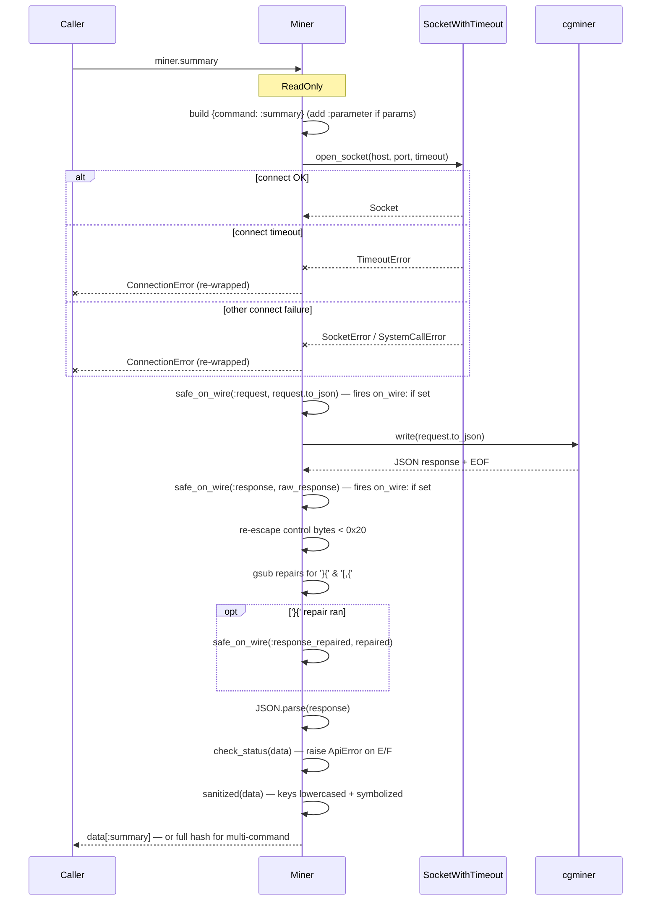
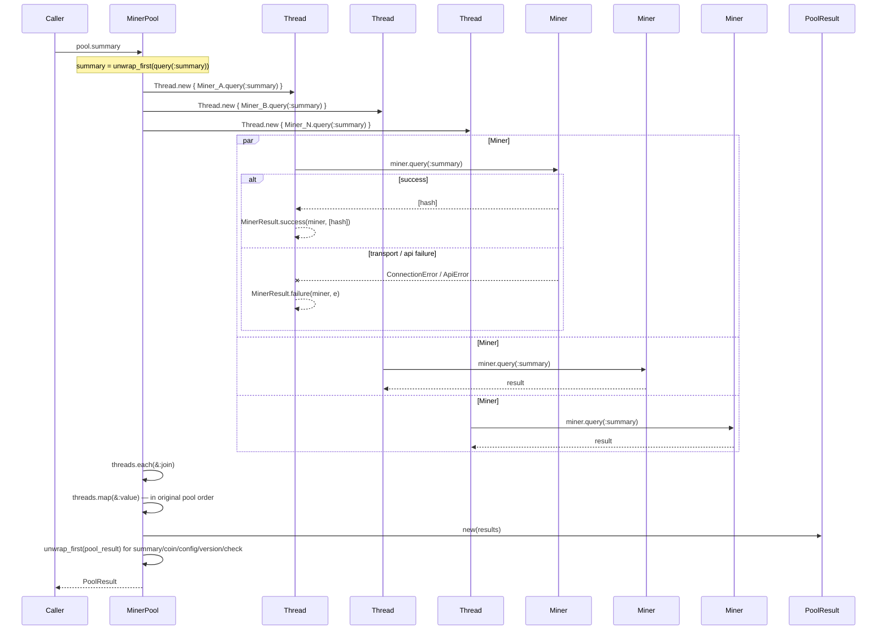
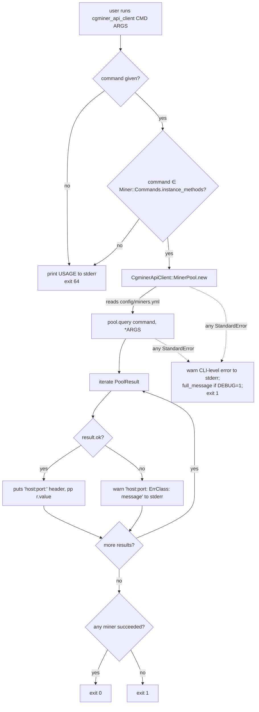
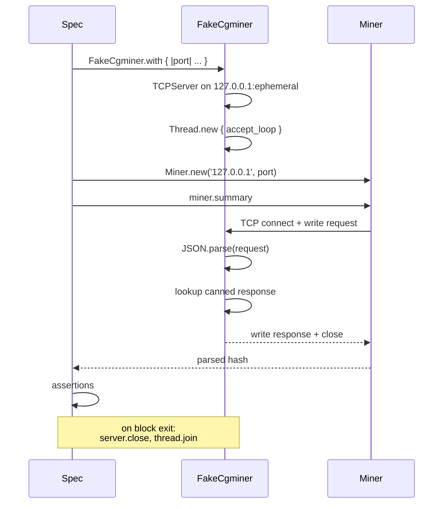

# Workflows

Three request flows cover essentially everything the gem does: single-miner query, parallel pool query, and CLI invocation. Plus two dev/test workflows: running the suite against a fake cgminer, and a manual sandbox loop.

## 1. Single-miner request flow (`Miner#query`)



**Key observations:**
- No retries, ever. Caller decides whether to retry.
- No connection reuse. Every call opens and closes a fresh socket.
- Read-to-EOF pattern. Server closing the socket is what signals "response complete."
- `Miner#query` only raises `ConnectionError` or `ApiError` (or a bug like `ArgumentError` if misused); cgminer `STATUS=I`/`STATUS=W` just print a line and continue.
- `safe_on_wire` is a no-op when `on_wire:` wasn't passed to `Miner.new`; when it was, any exception the callback raises is swallowed so a buggy logger can't break a query. See `docs/logging.md` for the full posture and the CLI's `-v`/`--verbose` flag, which is implemented by installing a default `on_wire` callback.

## 2. Parallel pool request flow (`MinerPool#query`)



**Key observations:**
- Each miner runs in its own `Thread`. True concurrency for I/O since `open_socket`, `socket.wait_writable`, `s.read` all release the GVL.
- Thread-local `rescue StandardError => e` turns **any** failure into a `MinerResult.failure`. The caller's pool query never itself raises a per-miner error (barring a bug outside the rescue, in which case `Thread#value` re-raises to the caller).
- `threads.map(&:value)` preserves pool order because the threads array preserves iteration order.
- `unwrap_first` is the final step for the five ReadOnly convenience methods (`summary`, `coin`, `config`, `version`, `check`). It walks the `PoolResult`, replacing each successful `MinerResult.value` with `value.first`. Failures pass through untouched.

## 3. CLI invocation flow (`bin/cgminer_api_client`)



**Key observations:**
- The CLI is the only code path that writes to stderr. Library code never does.
- Command validation is against `Miner::Commands.instance_methods`, which means every real cgminer command wrapped by `ReadOnly`/`Privileged` modules is callable from CLI. Unwrapped commands (those only reachable via `method_missing`) are not callable from CLI — this is by design.
- Top-level exceptions (e.g. `"Please create config/miners.yml"`) land in the outer `rescue StandardError` and produce exit 1 with the error on stderr.
- `DEBUG=1` enables full backtraces via `Exception#full_message(highlight: false)`. Without it, only the error class and message are shown.
- Partial success is explicitly a success (exit 0). Fleet-oriented tooling pattern — partial failures don't trigger alerts.

## 4. Development workflow

### Running tests

```sh
bundle install
bundle exec rspec                      # unit + integration
bundle exec rspec spec/cgminer_api_client  # unit only
bundle exec rspec spec/integration     # integration only
bundle exec rake                       # spec + rubocop (the default task)
```

**Coverage** is enabled automatically via SimpleCov (see `spec/spec_helper.rb`). Reports land in `coverage/`.

**RSpec config** (`.rspec`): `--color --warnings --require spec_helper`. Warnings are deliberately on — the suite is expected to run warning-clean.

### Integration tests

`spec/integration/miner_integration_spec.rb` exercises the full `Miner` request path against `FakeCgminer` running in a background thread in the same process. `spec/integration/cli_spec.rb` uses `Open3.capture3` to spawn the real `bin/cgminer_api_client` and assert on exit codes and stdout/stderr split.



### Manual sandbox (`script/fake_cgminer`)

Same `FakeCgminer` server, but foreground and long-running. Useful for exercising the CLI end-to-end without real mining hardware.

```sh
# terminal 1
./script/fake_cgminer 4028
# → fake cgminer listening on 127.0.0.1:4028
# → commands available: addpool, devs, pools, privileged, summary, summary+pools

# terminal 2
cp config/miners.yml.example config/miners.yml   # points at 127.0.0.1:4028
bundle exec bin/cgminer_api_client summary
# ... inspect output, iterate
```

### Linting

```sh
bundle exec rubocop                    # check
bundle exec rubocop -A                 # auto-correct (with caution)
```

`.rubocop.yml` turns off most `Metrics/*` cops (the gem is small and the defaults fight it without adding value) and the `RSpec/*` style cops (the existing suite uses idiomatic-for-its-time patterns). Correctness cops (`RSpec/RepeatedExample`, `RSpec/LeakyConstantDeclaration`, etc.) are deliberately left on — don't disable them without a specific reason.

## 5. Release / publish flow

Not automated. Manual process on a clean `master`:

```sh
bundle exec rake                                 # must pass
gem build cgminer_api_client.gemspec             # produces cgminer_api_client-X.Y.Z.gem
gem push cgminer_api_client-X.Y.Z.gem            # requires 2FA because rubygems_mfa_required
git tag vX.Y.Z
git push origin master vX.Y.Z
```

A `cgminer_api_client-0.3.0.gem` artifact is currently present at the repo root (untracked) from the 0.3.0 release.
